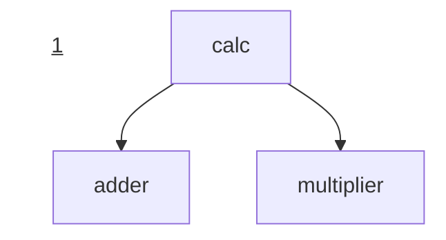
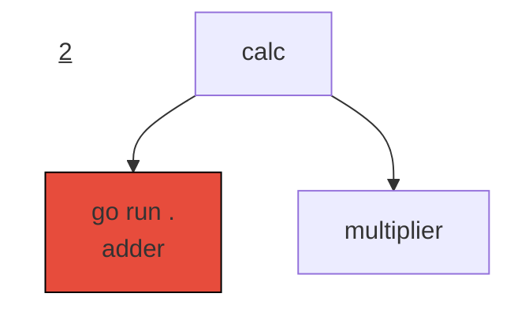
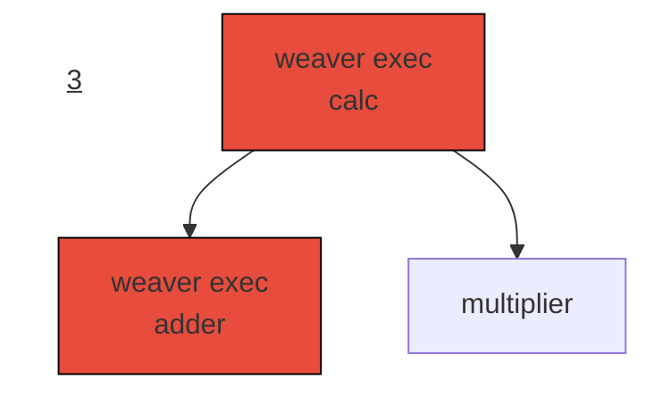
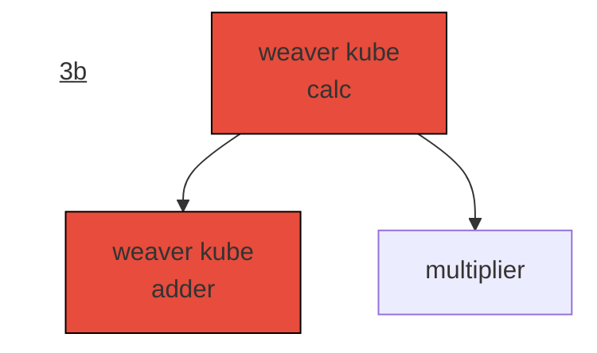
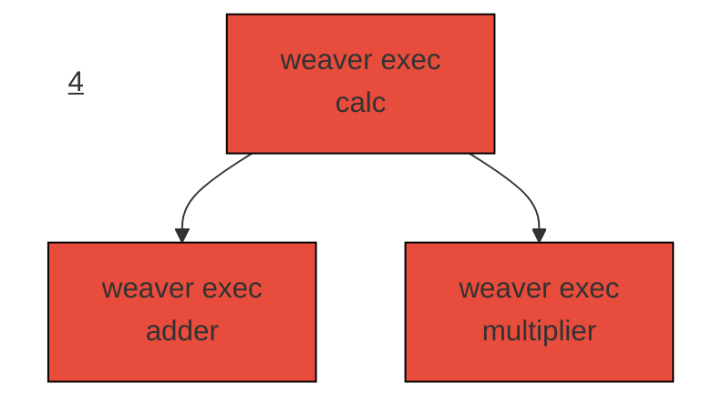
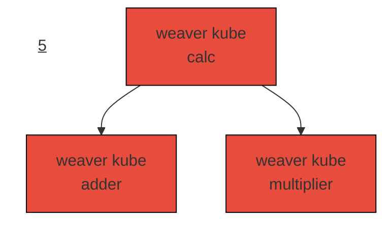

# Calculator

|    | Go  | Proto | YAML | TOML | Docker |
| -- | --- | ----- | ---- | ---- | ------ |
| 1  | 167 | 24    | 95   | 0    | 33     |
| 2  | 184 | 24    | 116  | 0    | 33     |
| 3  | 136 | 12    | 140  | 0    | 24     |
| 3b | 136 | 12    | 31   | 9    | 11     |
| 4  | 99  | 0     | 153  | 0    | 12     |
| 5  | 99  | 0     | 0    | 7    | 0      |
